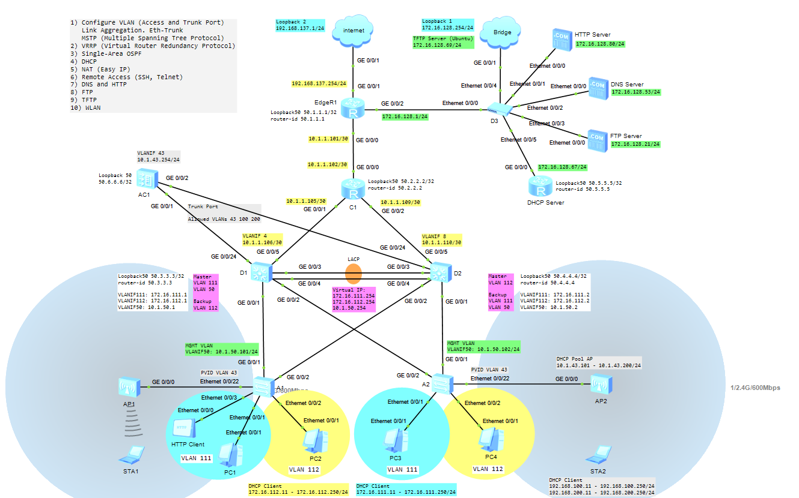

# WLAN

  


## Switch A1 and A2

Configure Device Hostname
```shell
undo terminal monitor
system-view
sysname A1
```

Create VLANs
```shell
vlan batch 43 100 200

vlan 43
 description MGMT VLAN
vlan 100
 description Service VLAN
vlan 200
 description Service VLAN

display vlan
```

Configure Trunk Port and Allowed VLANs
```shell
interface g0/0/1
 port link-type trunk
 port trunk allow-pass vlan 43 100 200

interface g0/0/2
 port link-type trunk
 port trunk allow-pass vlan 43 100 200

interface e0/0/22
 port link-type trunk
 port trunk pvid vlan 43
 port trunk allow-pass vlan 43 100 200

display port vlan
```

## Switch D1 and D2

Configure Hostname
```shell
system-view
sysname D1
```

Create VLANs
```shell
vlan batch 43 100 200

vlan 43
 description MGMT VLAN
vlan 100
 description Service VLAN
vlan 200
 description Service VLAN

display vlan
```

Configure Trunk Port and Allowed VLANs
```shell
interface g0/0/1
 port link-type trunk
 port trunk allow-pass vlan 43 100 200

interface g0/0/2
 port link-type trunk
 port trunk allow-pass vlan 43 100 200

interface g0/0/24
 port link-type trunk
 port trunk allow-pass vlan 43 100 200

display port vlan
```

Create VLANIF interface
```shell
interface vlanif 100
 ip address 192.168.100.254 24
 description Default Gateway for VLAN100

interface vlanif 200
 ip address 192.168.200.254 24
 description Default Gateway for VLAN200

display ip int brief
```

DHCP Pool for STAs
```shell
dhcp enable
ip pool VLAN100
 network 192.168.100.0 mask 24
 gateway-list 192.168.100.254
 dns-list 8.8.8.8
 excluded-ip-address 192.168.100.1 192.168.100.10
 excluded-ip-address 192.168.100.251 192.168.100.253
 lease day 5

interface vlanif 100
 dhcp select global
```

```shell
ip pool VLAN200
 network 192.168.200.0 mask 24
 gateway-list 192.168.200.254
 dns-list 8.8.8.8
 excluded-ip-address 192.168.200.1 192.168.200.10
 excluded-ip-address 192.168.200.251 192.168.200.253
 lease day 5

interface vlanif 200
 dhcp select global
```

```shell
display ip pool
```

## AC (Access Controller)

Configure Hostname
```shell
system-view
sysname AC1
```

Create VLANs
```shell
vlan batch 43 100 200

vlan 43
 description MGMT VLAN
vlan 100
 description Service VLAN
vlan 200
 description Service VLAN

display vlan brief
```

Configure Trunk Port and Allowed VLANs
```shell
interface g0/0/1
 port link-type trunk
 port trunk allow-pass vlan 43 100 200

interface g0/0/2
 port link-type trunk
 port trunk allow-pass vlan 43 100 200

display port vlan
```

Create VLANIF interface
```shell
interface vlanif 43
 ip address 10.1.43.254 24
 description Default Gateway for APs

display ip int brief
```

CAPWAP Tunnel
```shell
capwap source interface Vlanif 43
```

DHCP Pool for APs
```shell
dhcp enable
 ip pool AP
 network 10.1.43.0 mask 24
 gateway-list 10.1.43.254
 option 43 sub-option 2 ip-address 10.1.43.254
 excluded-ip-address 10.1.43.1 10.1.43.100
 excluded-ip-address 10.1.43.201 10.1.43.253
 lease day 5

interface vlanif 43
 dhcp select global

display ip pool
```

**1-қадам: WLAN mode**
```shell
system-view
wlan
```

**2-қадам: Create a Regulatory Domain Profile**
```shell
regulatory-domain-profile name default
 country-code kz
quit
```

**3-қадам: Create Security Profiles**
```shell
security-profile name WLAN-Staff
 security wpa-wpa2 psk pass-phrase Huawei@123 aes
quit
```
```shell
security-profile name WLAN-Guest
 security wpa-wpa2 psk pass-phrase Huawei@123 aes
quit
```

**4-қадам: Create SSID Profiles**
```shell
ssid-profile name WLAN-Staff
 ssid Staff-WiFi
quit
```

```shell
ssid-profile name WLAN-Guest
 ssid Guest-WiFi
quit
```

**5-қадам: Create VAP Profiles**
```shell
vap-profile name VAP-Staff
 forward-mode direct-forward
 service-vlan vlan-id 100
 ssid-profile WLAN-Staff
 security-profile WLAN-Staff
quit
```

```shell
vap-profile name VAP-Guest
 forward-mode direct-forward
 service-vlan vlan-id 200
 ssid-profile WLAN-Guest
 security-profile WLAN-Guest
quit
```

Import APs to the AC
```shell
wlan
 ap auth-mode mac-auth
 ap-id 0 ap-mac 00E0-FC17-3630
 ap-name AP1
 ap-group ap-group1
 quit

 ap-id 1 ap-mac 00E0-FC56-68e0
 ap-name AP2
 ap-group ap-group1
 quit
```

**6-қадам: AP Group**

```shell
ap-group name ap-group1
 regulatory-domain-profile default

 vap-profile VAP-Staff wlan 1 radio all
 vap-profile VAP-Guest wlan 2 radio all
quit
```

```shell
display ap all
```

**7-қадам: Verify the Configuration**
```shell
General Status
<AC1> display ap all
State: "Normal"
State: "Fault немесе idle" болса, AP-мен байланыс жоқ дегенді білдіреді!
```

```shell
STA1> ipconfig
STA2> ipconfig
```
